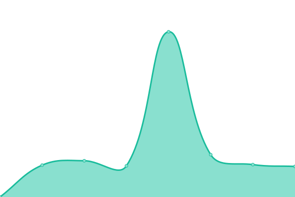

# [📈 Live Status](https://andres-chirinos.github.io/upptime): <!--live status--> **🟧 Partial outage**

This repository contains the open-source uptime monitor and status page for [Andrés Chirinos](andres-chirinos.github.io), powered by [Upptime](https://github.com/upptime/upptime).

With [Upptime](https://upptime.js.org), you can get your own unlimited and free uptime monitor and status page, powered entirely by a GitHub repository. We use [Issues](https://github.com/andres-chirinos/upptime/issues) as incident reports, [Actions](https://github.com/andres-chirinos/upptime/actions) as uptime monitors, and [Pages](https://andres-chirinos.github.io/upptime) for the status page.

<!--start: status pages-->
<!-- This summary is generated by Upptime (https://github.com/upptime/upptime) -->
<!-- Do not edit this manually, your changes will be overwritten -->
<!-- prettier-ignore -->
| URL | Status | History | Response Time | Uptime |
| --- | ------ | ------- | ------------- | ------ |
|  [Agencia Nacional de Hidrocarburos (ANH)](https://www.anh.gob.bo) | 🟩 Up | [agencia-nacional-de-hidrocarburos-anh.yml](https://github.com/andres-chirinos/upptime/commits/HEAD/history/agencia-nacional-de-hidrocarburos-anh.yml) | 

 1517ms
     
 | 

<a href="https://andres-chirinos.github.io/upptime/history/agencia-nacional-de-hidrocarburos-anh">99.70%</a>
    

|  [Servicio General de Identificación Personal (SEGIP)](https://www.segip.gob.bo) | 🟩 Up | [servicio-general-de-identificacion-personal-segip.yml](https://github.com/andres-chirinos/upptime/commits/HEAD/history/servicio-general-de-identificacion-personal-segip.yml) | 

 1018ms
     
 | 

<a href="https://andres-chirinos.github.io/upptime/history/servicio-general-de-identificacion-personal-segip">100.00%</a>
    

|  [Servicio de Impuestos Nacionales (SIN)](https://www.impuestos.gob.bo) | 🟥 Down | [servicio-de-impuestos-nacionales-sin.yml](https://github.com/andres-chirinos/upptime/commits/HEAD/history/servicio-de-impuestos-nacionales-sin.yml) | 

 0ms
     
 | 

<a href="https://andres-chirinos.github.io/upptime/history/servicio-de-impuestos-nacionales-sin">0.00%</a>
    

|  [Ministerio de Educación](https://www.minedu.gob.bo) | 🟩 Up | [ministerio-de-educacion.yml](https://github.com/andres-chirinos/upptime/commits/HEAD/history/ministerio-de-educacion.yml) | 

 3712ms
     
 | 

<a href="https://andres-chirinos.github.io/upptime/history/ministerio-de-educacion">100.00%</a>
    

|  [Tribunal Supremo Electoral (TSE)](https://www.oep.org.bo) | 🟩 Up | [tribunal-supremo-electoral-tse.yml](https://github.com/andres-chirinos/upptime/commits/HEAD/history/tribunal-supremo-electoral-tse.yml) | 

 2498ms
     
 | 

<a href="https://andres-chirinos.github.io/upptime/history/tribunal-supremo-electoral-tse">99.75%</a>
    

|  [Asamblea Legislativa Plurinacional de Bolivia](https://diputados.gob.bo/) | 🟩 Up | [asamblea-legislativa-plurinacional-de-bolivia.yml](https://github.com/andres-chirinos/upptime/commits/HEAD/history/asamblea-legislativa-plurinacional-de-bolivia.yml) | 

 1552ms
     
 | 

<a href="https://andres-chirinos.github.io/upptime/history/asamblea-legislativa-plurinacional-de-bolivia">100.00%</a>
    

|  [Cámara de Senadores](https://www.senado.gob.bo/) | 🟩 Up | [camara-de-senadores.yml](https://github.com/andres-chirinos/upptime/commits/HEAD/history/camara-de-senadores.yml) | 

 2002ms
     
 | 

<a href="https://andres-chirinos.github.io/upptime/history/camara-de-senadores">70.26%</a>
    

|  [Cámara de Diputados](https://www.diputados.bo) | 🟩 Up | [camara-de-diputados.yml](https://github.com/andres-chirinos/upptime/commits/HEAD/history/camara-de-diputados.yml) | 

 1937ms
     
 | 

<a href="https://andres-chirinos.github.io/upptime/history/camara-de-diputados">100.00%</a>
    

|  [Gaceta Oficial del Estado Plurinacional de Bolivia](http://www.gacetaoficialdebolivia.gob.bo/) | 🟩 Up | [gaceta-oficial-del-estado-plurinacional-de-bolivia.yml](https://github.com/andres-chirinos/upptime/commits/HEAD/history/gaceta-oficial-del-estado-plurinacional-de-bolivia.yml) | 

 2890ms
     
 | 

<a href="https://andres-chirinos.github.io/upptime/history/gaceta-oficial-del-estado-plurinacional-de-bolivia">97.66%</a>
    

|  [Defensoría del Pueblo](https://www.defensoria.gob.bo) | 🟩 Up | [defensoria-del-pueblo.yml](https://github.com/andres-chirinos/upptime/commits/HEAD/history/defensoria-del-pueblo.yml) | 

 2298ms
     
 | 

<a href="https://andres-chirinos.github.io/upptime/history/defensoria-del-pueblo">100.00%</a>
    

|  [Contraloría General del Estado](https://www.contraloria.gob.bo) | 🟩 Up | [contraloria-general-del-estado.yml](https://github.com/andres-chirinos/upptime/commits/HEAD/history/contraloria-general-del-estado.yml) | 

 1689ms
     
 | 

<a href="https://andres-chirinos.github.io/upptime/history/contraloria-general-del-estado">100.00%</a>
    

|  [Procuraduría General del Estado](https://www.procuraduria.gob.bo) | 🟥 Down | [procuraduria-general-del-estado.yml](https://github.com/andres-chirinos/upptime/commits/HEAD/history/procuraduria-general-del-estado.yml) | 

 0ms
     
 | 

<a href="https://andres-chirinos.github.io/upptime/history/procuraduria-general-del-estado">0.00%</a>
    

|  [Universidad Mayor de San Andrés (UMSA)](https://www.umsa.bo) | 🟩 Up | [universidad-mayor-de-san-andres-umsa.yml](https://github.com/andres-chirinos/upptime/commits/HEAD/history/universidad-mayor-de-san-andres-umsa.yml) | 

 1901ms
     
 | 

<a href="https://andres-chirinos.github.io/upptime/history/universidad-mayor-de-san-andres-umsa">100.00%</a>
    

|  [Universidad Técnica de Oruro (UTO)](https://www.uto.edu.bo) | 🟩 Up | [universidad-tecnica-de-oruro-uto.yml](https://github.com/andres-chirinos/upptime/commits/HEAD/history/universidad-tecnica-de-oruro-uto.yml) | 

 2055ms
     
 | 

<a href="https://andres-chirinos.github.io/upptime/history/universidad-tecnica-de-oruro-uto">100.00%</a>
    

|  [Sistema de Universidades Bolivianas (CEUB)](https://www.ceub.edu.bo) | 🟩 Up | [sistema-de-universidades-bolivianas-ceub.yml](https://github.com/andres-chirinos/upptime/commits/HEAD/history/sistema-de-universidades-bolivianas-ceub.yml) | 

 1643ms
     
 | 

<a href="https://andres-chirinos.github.io/upptime/history/sistema-de-universidades-bolivianas-ceub">100.00%</a>
    

|  [Administradora Boliviana de Carreteras (ABC)](https://www.viasbolivia.gob.bo/) | 🟥 Down | [administradora-boliviana-de-carreteras-abc.yml](https://github.com/andres-chirinos/upptime/commits/HEAD/history/administradora-boliviana-de-carreteras-abc.yml) | 

 0ms
     
 | 

<a href="https://andres-chirinos.github.io/upptime/history/administradora-boliviana-de-carreteras-abc">0.00%</a>
    

|  [Empresa Nacional de Telecomunicaciones (ENTEL)](https://www.entel.bo) | 🟩 Up | [empresa-nacional-de-telecomunicaciones-entel.yml](https://github.com/andres-chirinos/upptime/commits/HEAD/history/empresa-nacional-de-telecomunicaciones-entel.yml) | 

 1309ms
     
 | 

<a href="https://andres-chirinos.github.io/upptime/history/empresa-nacional-de-telecomunicaciones-entel">100.00%</a>
    

|  [Banco Unión](https://www.bancounion.com.bo) | 🟩 Up | [banco-union.yml](https://github.com/andres-chirinos/upptime/commits/HEAD/history/banco-union.yml) | 

 1375ms
     
 | 

<a href="https://andres-chirinos.github.io/upptime/history/banco-union">100.00%</a>
    

|  [Banco Central de Bolivia (BCB)](https://www.bcb.gob.bo) | 🟩 Up | [banco-central-de-bolivia-bcb.yml](https://github.com/andres-chirinos/upptime/commits/HEAD/history/banco-central-de-bolivia-bcb.yml) | 

 1453ms
     
 | 

<a href="https://andres-chirinos.github.io/upptime/history/banco-central-de-bolivia-bcb">100.00%</a>
    

|  [Bolivia TV (BTV)](https://www.boliviatv.bo) | 🟩 Up | [bolivia-tv-btv.yml](https://github.com/andres-chirinos/upptime/commits/HEAD/history/bolivia-tv-btv.yml) | 

 2937ms
     
 | 

<a href="https://andres-chirinos.github.io/upptime/history/bolivia-tv-btv">100.00%</a>
    

|  [Boliviana de Aviación (BoA)](https://www.boa.bo) | 🟩 Up | [boliviana-de-aviacion-bo-a.yml](https://github.com/andres-chirinos/upptime/commits/HEAD/history/boliviana-de-aviacion-bo-a.yml) | 

 418ms
     
 | 

<a href="https://andres-chirinos.github.io/upptime/history/boliviana-de-aviacion-bo-a">99.45%</a>
    

|  [Seguros y Reaseguros Personales UNIVIDA](https://www.univida.bo) | 🟩 Up | [seguros-y-reaseguros-personales-univida.yml](https://github.com/andres-chirinos/upptime/commits/HEAD/history/seguros-y-reaseguros-personales-univida.yml) | 

 1149ms
     
 | 

<a href="https://andres-chirinos.github.io/upptime/history/seguros-y-reaseguros-personales-univida">100.00%</a>
    

|  [Yacimientos Petrolíferos Fiscales Bolivianos (YPFB)](https://www.ypfb.gob.bo) | 🟩 Up | [yacimientos-petroliferos-fiscales-bolivianos-ypfb.yml](https://github.com/andres-chirinos/upptime/commits/HEAD/history/yacimientos-petroliferos-fiscales-bolivianos-ypfb.yml) | 

 2916ms
     
 | 

<a href="https://andres-chirinos.github.io/upptime/history/yacimientos-petroliferos-fiscales-bolivianos-ypfb">100.00%</a>
    

|  [Autoridad de Supervisión del Sistema Financiero (ASFI)](https://www.asfi.gob.bo) | 🟩 Up | [autoridad-de-supervision-del-sistema-financiero-asfi.yml](https://github.com/andres-chirinos/upptime/commits/HEAD/history/autoridad-de-supervision-del-sistema-financiero-asfi.yml) | 

 1653ms
     
 | 

<a href="https://andres-chirinos.github.io/upptime/history/autoridad-de-supervision-del-sistema-financiero-asfi">100.00%</a>
    

|  [Aduana Nacional de Bolivia](https://www.aduana.gob.bo) | 🟥 Down | [aduana-nacional-de-bolivia.yml](https://github.com/andres-chirinos/upptime/commits/HEAD/history/aduana-nacional-de-bolivia.yml) | 

 2215ms
     
 | 

<a href="https://andres-chirinos.github.io/upptime/history/aduana-nacional-de-bolivia">60.63%</a>
    

|  [Ministerio de Salud y Deportes](https://www.minsalud.gob.bo) | 🟩 Up | [ministerio-de-salud-y-deportes.yml](https://github.com/andres-chirinos/upptime/commits/HEAD/history/ministerio-de-salud-y-deportes.yml) | 

 1395ms
     
 | 

<a href="https://andres-chirinos.github.io/upptime/history/ministerio-de-salud-y-deportes">98.63%</a>
    

|  [Policía Boliviana](https://www.policia.bo) | 🟩 Up | [policia-boliviana.yml](https://github.com/andres-chirinos/upptime/commits/HEAD/history/policia-boliviana.yml) | 

 2530ms
     
 | 

<a href="https://andres-chirinos.github.io/upptime/history/policia-boliviana">50.53%</a>
    

|  [Ministerio de Justicia y Transparencia Institucional](https://www.justicia.gob.bo) | 🟥 Down | [ministerio-de-justicia-y-transparencia-institucional.yml](https://github.com/andres-chirinos/upptime/commits/HEAD/history/ministerio-de-justicia-y-transparencia-institucional.yml) | 

 0ms
     
 | 

<a href="https://andres-chirinos.github.io/upptime/history/ministerio-de-justicia-y-transparencia-institucional">100.00%</a>
    

|  [Autoridad de Fiscalización y Control de Pensiones y Seguros (APS)](https://www.aps.gob.bo) | 🟩 Up | [autoridad-de-fiscalizacion-y-control-de-pensiones-y-seguros-aps.yml](https://github.com/andres-chirinos/upptime/commits/HEAD/history/autoridad-de-fiscalizacion-y-control-de-pensiones-y-seguros-aps.yml) | 

 7252ms
     
 | 

<a href="https://andres-chirinos.github.io/upptime/history/autoridad-de-fiscalizacion-y-control-de-pensiones-y-seguros-aps">100.00%</a>
    

|  [Instituto Nacional de Estadística (INE)](https://www.ine.gob.bo) | 🟩 Up | [instituto-nacional-de-estadistica-ine.yml](https://github.com/andres-chirinos/upptime/commits/HEAD/history/instituto-nacional-de-estadistica-ine.yml) | 

 2662ms
     
 | 

<a href="https://andres-chirinos.github.io/upptime/history/instituto-nacional-de-estadistica-ine">100.00%</a>
    

|  [Ministerio de Defensa](https://www.mindef.gob.bo) | 🟥 Down | [ministerio-de-defensa.yml](https://github.com/andres-chirinos/upptime/commits/HEAD/history/ministerio-de-defensa.yml) | 

 0ms
     
 | 

<a href="https://andres-chirinos.github.io/upptime/history/ministerio-de-defensa">0.00%</a>
    

|  [Ministerio de Obras Públicas, Servicios y Vivienda](https://www.oopp.gob.bo) | 🟩 Up | [ministerio-de-obras-publicas-servicios-y-vivienda.yml](https://github.com/andres-chirinos/upptime/commits/HEAD/history/ministerio-de-obras-publicas-servicios-y-vivienda.yml) | 

 6271ms
     
 | 

<a href="https://andres-chirinos.github.io/upptime/history/ministerio-de-obras-publicas-servicios-y-vivienda">100.00%</a>
    

|  [Dirección General de Aeronáutica Civil (DGAC)](https://www.dgac.gob.bo) | 🟩 Up | [direccion-general-de-aeronautica-civil-dgac.yml](https://github.com/andres-chirinos/upptime/commits/HEAD/history/direccion-general-de-aeronautica-civil-dgac.yml) | 

 1053ms
     
 | 

<a href="https://andres-chirinos.github.io/upptime/history/direccion-general-de-aeronautica-civil-dgac">97.62%</a>
    

|  [Servicio Nacional de Propiedad Intelectual (SENAPI)](https://www.senapi.gob.bo/) | 🟩 Up | [servicio-nacional-de-propiedad-intelectual-senapi.yml](https://github.com/andres-chirinos/upptime/commits/HEAD/history/servicio-nacional-de-propiedad-intelectual-senapi.yml) | 

 1087ms
     
 | 

<a href="https://andres-chirinos.github.io/upptime/history/servicio-nacional-de-propiedad-intelectual-senapi">100.00%</a>
    

|  [Autoridad de Fiscalización de Electricidad y Tecnología Nuclear (AETN)](https://www.aetn.gob.bo) | 🟩 Up | [autoridad-de-fiscalizacion-de-electricidad-y-tecnologia-nuclear-aetn.yml](https://github.com/andres-chirinos/upptime/commits/HEAD/history/autoridad-de-fiscalizacion-de-electricidad-y-tecnologia-nuclear-aetn.yml) | 

 2329ms
     
 | 

<a href="https://andres-chirinos.github.io/upptime/history/autoridad-de-fiscalizacion-de-electricidad-y-tecnologia-nuclear-aetn">100.00%</a>
    

|  [Mi Teleférico](https://www.miteleferico.bo) | 🟩 Up | [mi-teleferico.yml](https://github.com/andres-chirinos/upptime/commits/HEAD/history/mi-teleferico.yml) | 

 708ms
     
 | 

<a href="https://andres-chirinos.github.io/upptime/history/mi-teleferico">100.00%</a>
    

|  [Servicio Nacional de Meteorología e Hidrología (SENAMHI)](https://www.senamhi.gob.bo) | 🟩 Up | [servicio-nacional-de-meteorologia-e-hidrologia-senamhi.yml](https://github.com/andres-chirinos/upptime/commits/HEAD/history/servicio-nacional-de-meteorologia-e-hidrologia-senamhi.yml) | 

 1906ms
     
 | 

<a href="https://andres-chirinos.github.io/upptime/history/servicio-nacional-de-meteorologia-e-hidrologia-senamhi">100.00%</a>
    

|  [Agencia Boliviana Espacial (ABE)](https://www.abe.bo) | 🟩 Up | [agencia-boliviana-espacial-abe.yml](https://github.com/andres-chirinos/upptime/commits/HEAD/history/agencia-boliviana-espacial-abe.yml) | 

 5503ms
     
 | 

<a href="https://andres-chirinos.github.io/upptime/history/agencia-boliviana-espacial-abe">100.00%</a>
    

|  [Caja Nacional de Salud (CNS)](https://www.cns.gob.bo) | 🟩 Up | [caja-nacional-de-salud-cns.yml](https://github.com/andres-chirinos/upptime/commits/HEAD/history/caja-nacional-de-salud-cns.yml) | 

 1380ms
     
 | 

<a href="https://andres-chirinos.github.io/upptime/history/caja-nacional-de-salud-cns">100.00%</a>
    

|  [Autoridad de Regulación y Fiscalización de Telecomunicaciones y Transportes (ATT)](https://www.att.gob.bo) | 🟩 Up | [autoridad-de-regulacion-y-fiscalizacion-de-telecomunicaciones-y-transportes-att.yml](https://github.com/andres-chirinos/upptime/commits/HEAD/history/autoridad-de-regulacion-y-fiscalizacion-de-telecomunicaciones-y-transportes-att.yml) | 

 900ms
     
 | 

<a href="https://andres-chirinos.github.io/upptime/history/autoridad-de-regulacion-y-fiscalizacion-de-telecomunicaciones-y-transportes-att">100.00%</a>
    

|  [Empresa Nacional de Electricidad (ENDE)](https://www.ende.bo) | 🟩 Up | [empresa-nacional-de-electricidad-ende.yml](https://github.com/andres-chirinos/upptime/commits/HEAD/history/empresa-nacional-de-electricidad-ende.yml) | 

 1147ms
     
 | 

<a href="https://andres-chirinos.github.io/upptime/history/empresa-nacional-de-electricidad-ende">100.00%</a>
    

|  [Instituto Boliviano de Comercio Exterior (IBCE)](https://www.ibce.org.bo) | 🟩 Up | [instituto-boliviano-de-comercio-exterior-ibce.yml](https://github.com/andres-chirinos/upptime/commits/HEAD/history/instituto-boliviano-de-comercio-exterior-ibce.yml) | 

 1106ms
     
 | 

<a href="https://andres-chirinos.github.io/upptime/history/instituto-boliviano-de-comercio-exterior-ibce">100.00%</a>
    

|  [Ministerio de Medio Ambiente y Agua](https://www.mmaya.gob.bo) | 🟩 Up | [ministerio-de-medio-ambiente-y-agua.yml](https://github.com/andres-chirinos/upptime/commits/HEAD/history/ministerio-de-medio-ambiente-y-agua.yml) | 

 4830ms
     
 | 

<a href="https://andres-chirinos.github.io/upptime/history/ministerio-de-medio-ambiente-y-agua">100.00%</a>
    

|  [Agencia para el Desarrollo de la Sociedad de la Información en Bolivia (ADSIB)](https://www.adsib.gob.bo) | 🟩 Up | [agencia-para-el-desarrollo-de-la-sociedad-de-la-informacion-en-bolivia-adsib.yml](https://github.com/andres-chirinos/upptime/commits/HEAD/history/agencia-para-el-desarrollo-de-la-sociedad-de-la-informacion-en-bolivia-adsib.yml) | 

 1542ms
     
 | 

<a href="https://andres-chirinos.github.io/upptime/history/agencia-para-el-desarrollo-de-la-sociedad-de-la-informacion-en-bolivia-adsib">100.00%</a>
    

<!--end: status pages-->

[**Visit our status website →**](https://andres-chirinos.github.io/upptime)

## 📄 License

- Powered by: [Upptime](https://github.com/upptime/upptime)
- Code: [MIT](./LICENSE) © [Anand Chowdhary](https://anandchowdhary.com), supported by [Pabio](https://pabio.com)
- Data in the `./history` directory: [Open Database License](https://opendatacommons.org/licenses/odbl/1-0/)
